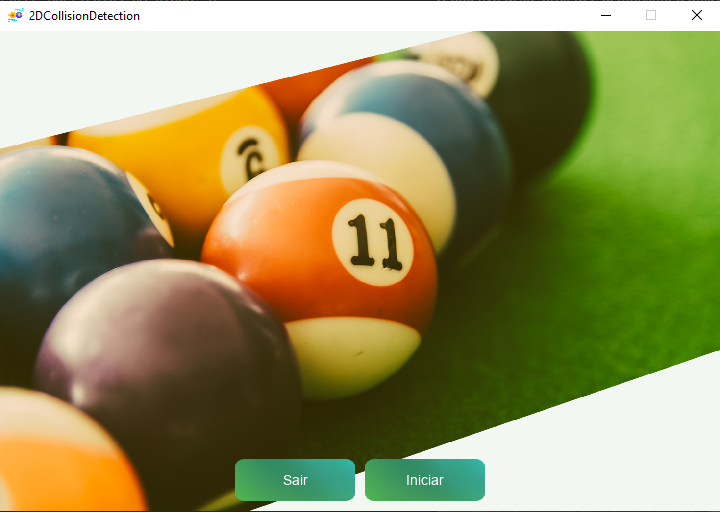
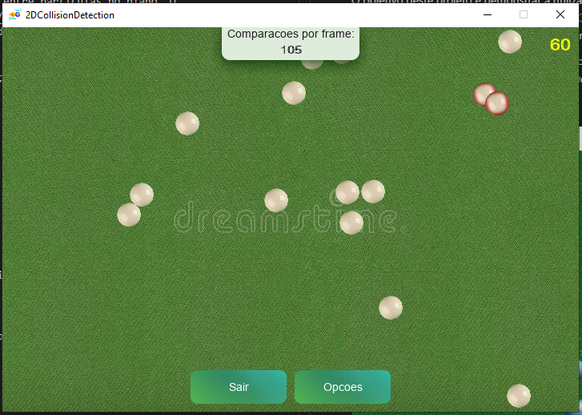
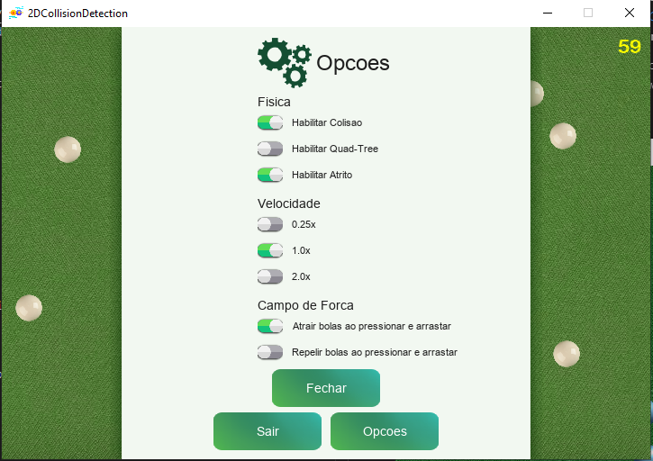

# D&C_2DCollisionDetection

**Número da Lista**: X<br>
**Conteúdo da Disciplina**: Dividir e Conquistar<br>

## Alunos
|Matrícula | Aluno |
| -- | -- |
| 16/0049733  |  Felipe Borges de Souza Chaves |
| 18/0055241  |  Victor Jorge da Silva Gonçalves |

## Sobre 
O objetivo deste projeto é demonstrar a utilização de um algoritmo sofisticado para a [detecção de colisão](https://en.wikipedia.org/wiki/Collision_detection) entre particulas no plano. O algoritmo adotado para este trabalho foi o [_Quadtree_](https://en.wikipedia.org/wiki/Quadtree). Neste projeto, demonstramos a utilização do algoritmo através da simulação de uma mesa de bilhar com várias bolas colidindo entre si.

O principal artefato deste projeto, que é o algoritmo de detecção, pode ser visualizado neste [arquivo](2DCollisionDetection/src/CollisionDetection.cpp) que implementa duas funções de colisão, uma de complexidade _O(n²)_ e a _Quadtree_.

Vale, entretanto, ressaltar que o projeto possui além do algoritmo de divisão e conquista, muitos outros paradigmas e estruturas contidas em sua elaboração, a saber: árvores, grafos e mapas. Com bastante afinco e dedicação, a dupla utilizou dos diversos conhecimentos da matéria e implementou manualmente cada elemento da interface gráfica, apenas com a ajuda de uma biblioteca de baixo nível para rederização de retângulos, fontes e imagens ([_SDL_](https://wiki.libsdl.org/)).

## Screenshots




## Instalação 

**Linguagem**: C++<br>
**Biblioteca**: SDL 2.0<br>

> Em caso de não portabilidade, entre em contato com a dupla!

### Distribuições Linux Ubuntu ou Debian

Para efetuar a instalação das dependências, execute os comandos:


```bash
sudo apt-get install g++
```
```bash
make
```
```bash
sudo apt-get install libsdl2-dev
```
```bash
sudo apt-get install libsdl2-image-dev
```
```bash
sudo apt-get install libsdl2-ttf-dev
```

### Windows

Infelizmente, o código deste projeto utiliza de cabeçalhos e esquemas de compilação que não são portáveis para Windows. Sendo assim, para a correta execução do código recomendamos a instalação do [WSL 1](https://docs.microsoft.com/pt-br/windows/wsl/install-win10), do [VcXsrv](https://sourceforge.net/projects/vcxsrv/) e do [Ubuntu 18.04](https://www.microsoft.com/en-us/p/ubuntu-1804-lts/9n9tngvndl3q?activetab=pivot:overviewtab) sobre o WSL1.

Execute os mesmos passos citados para Ubuntu no bash instalado.

### MacOS

Para instalar o SDL no MacOS, recomendamos o uso do [_homebew_](https://brew.sh/index_pt-br).

No terminal, execute:

```bash
brew install make
```

```bash
brew install sdl2
```

```bash
brew install sdl2_ttf
```

```bash
brew install sdl2_image
```

## Uso 
A execução da aplicação é simples e pode ser feita executando comando abaixo a partir do diretório 2DCollisionDetection.

```bash
make && make run
```
> Para usuários do Ubuntu no WSL1, será necessário executar o VcXsrv no Windows e executar no bash o seguinte comando:
>
> ```bash
> export DISPLAY=:0
> ```
