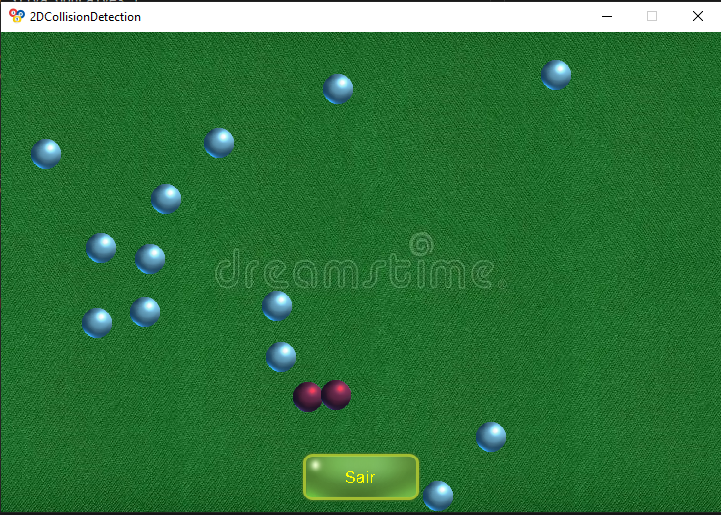

# D&C_2DCollisionDetection

**Número da Lista**: X<br>
**Conteúdo da Disciplina**: Dividir e Conquistar<br>

## Alunos
|Matrícula | Aluno |
| -- | -- |
| 16/0049733  |  Felipe Borges de Souza Chaves |
| 18/0055241  |  Victor Jorge da Silva Gonçalves |

## Sobre 
O objetivo deste projeto é oferecer uma abordagem eficiente para a detecção de colisões no plano 2D. A detecção de colisões no plano 2D pode ser empregada em diversos contextos, tais como física para jogos e interfaces gráficas. Neste projeto em questão, utilizou-se de colisões entre bolas sobre uma mesa de bilhar.

O principal artefato deste projeto pode ser verificado no [arquivo](2DCollsionDetection/inc/CollisionDetection.hpp) que implementa as funções de colisões utilizando de algoritmos pertencentes ao paradigma dividir e conquistar.
Nota-se que para um sistema com uma quantidade de particulas na ordem de 10^4, a detecção de colisão se torna extremamente lenta e cara para a aplicação ao se utilizar de algoritmos triviais de complexidade O(N²).

## Screenshots


Adicione 3 ou mais screenshots do projeto em funcionamento.

## Instalação 
**Linguagem**: C++<br>
**Biblioteca**: SDL 2.0<br>

É necessário ter instalado o compilador GCC, make, SDL2, SDL2_image, SDL2_ttf.

### Ubuntu ou Debian

No Ubuntu ou Debian, você pode instalar as dependencias deste projeto utilizando os seguintes comandos:
```bash
sudo apt-get install g++
```
```bash
make
```
```bash
sudo apt-get install libsdl2-dev
```
```bash
sudo apt-get install libsdl2-image-dev
```
```bash
sudo apt-get install libsdl2-ttf-dev
```

### MacOS

TODO

Descreva os pré-requisitos para rodar o seu projeto e os comandos necessários.

## Uso 
Na pasta _2DCollisionDetection_, rode o seguinte comando:

```bash
make && make run
```

## Outros 
Quaisquer outras informações sobre seu projeto podem ser descritas abaixo.


